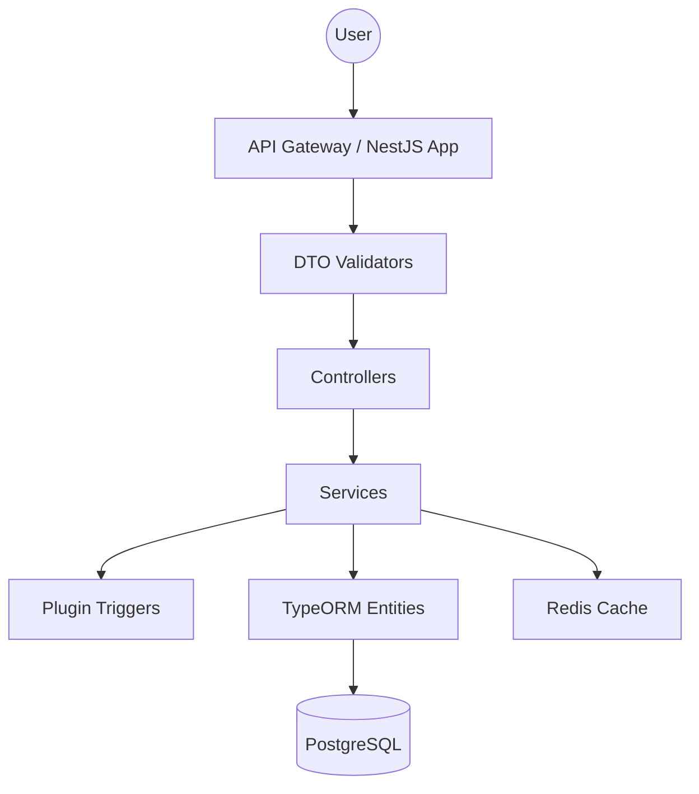

# Architecture

The Assessment service follows a clean, modular architecture provided by NestJS, emphasizing separation of concerns, scalability, and plugin extensibility.

### Module Overview

The application is structured into several core modules:

- **Test Module**: Manages test definitions, constraints, and test-level lifecycle (draft to publish).
- **Question Module**: Handles versatile question type schemas, mappings, and criteria.
- **Attempt Module**: Central component responsible for user progress tracking, attempting test evaluation logic, and score grading.
- **Review Module**: Segregated module orchestrating manual rubric-based evaluations for subjective interactions.
- **Plugin Module**: Pluggable extension handling internal and external event-driven behaviors.

### High-Level Flow

### Key Architectural Patterns
1. **Repository Pattern**: Abstracting PostgreSQL interactions through TypeORM repositories to cleanly decouple query logic.
2. **Loosely Coupled Plugin System**: Incorporating internal in-process event handlers and external webhooks (Phase 2) to offload logic without touching core operations.
3. **Multi-tenancy Implicit Control**: Mandated header extraction intercepts, meaning tenants are never cross-polluted in data retrieval scenarios.
4. **Exception Filters**: Centralized HTTP error handling, catching `VALIDATION_ERROR`, `CONFLICT`, and parsing DB exceptions into user-friendly standardized responses.
5. **DTOs (Data Transfer Objects)**: Strictly defining diverse input schemas for varying question formats and answer payloads.
